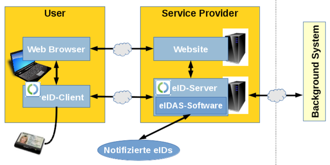
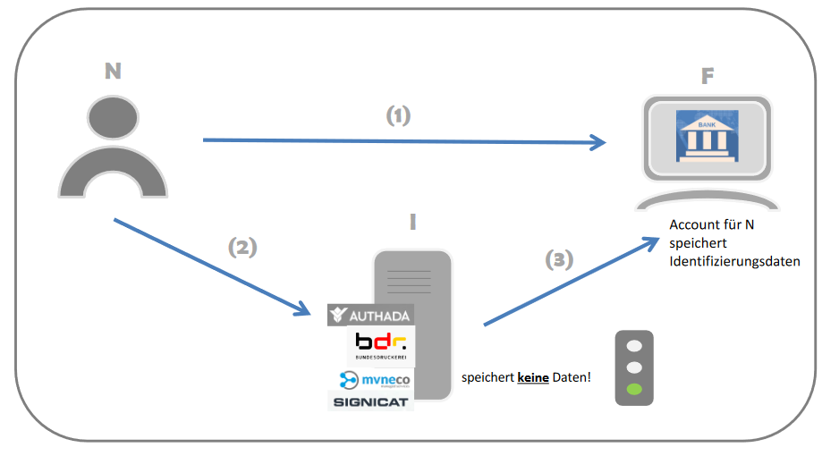

# Electronic Identification Functions (Germany)

The eID system has been in place for around 11 years and is one of the more modern technologies Germany has to offer. It is mainly used for regional services like civic services, insurances or financial institutions. This repository contains information for regional and international services alike that want to make use of the eID system.

- [Features of the eID System](#features-of-the-eid-system)
  - [Automated Age Verification](#automated-age-verification)
- [How to start using the eID system](#how-to-start-using-the-eid-system)
  - [How it works](#how-it-works)
  - [User-Requirements](#user-requirements)
  - [Service-Requirements](#service-requirements)
    - [Building your own eID server](#building-your-own-eid-server)
    - [Using an eID service provider](#using-an-eid-service-provider)
    - [Getting an Authorization Certificate](#getting-an-authorization-certificate)
    - [Using an identification service provider](#using-an-identification-service-provider)
- [Links](#links)

## Features of the eID System

The two main features are:

1) Authentication
2) Access to personal information

Authentication using the eID system instead of a normal E-Mail + Password combination is useful for services that only allow one account per person since there is a one to one relation between eID cards and people. The information on the eID cards can be queried and used to eg make sure the person if of legal age or has a residence in Germany. Since this is Germany we are talking about, you have to understand that tight privacy policies have to be established before you can get access to the personal information.

Below you can find some examples that use the eID system.

### Automated Age Verification

Buying physical media products like movies or games have in-person age verification where you will be asked for your ID in the store or on delivery. Online providers with online-only products do not have the option for in-person age verification. There are currently two common verification processes used by various online providers:

1) using a credit card
2) using a photo of your ID

Both of these options are terrible. We all know the "stealing your moms credit card to but vbucks"-meme but aside from easily faking this, it can actually be harder to proof that your of age simply because you don't have a credit card or because you don't want any weird transactions in your bank account history. The other option is simply a manual verification by an employee using a photo of your ID which is not automated meaning you have to pay someone to do this and the company now has a photo of your ID containing not only your age but also your full legal name, nationality, place of birth, signature, address, eye colour, height and all other information that is on your ID. Both options are terrible user experiences, create tons of privacy issues and should be replaced using the eID functions.

With the eID system you can simply check if the user is over a specific age, you don't even have to query the age itself you can just ask "is the user above age X" and then you get a yes/no response.

## How to start using the eID system

In this section we take a look at how the eID system works, which options you have to integrate it into your service, what requirements need to be fulfilled and how the technical integration can look like. Do note that this is not a be-all-end-all guide and all based on my personal understanding of official documents and articles. The official information for businesses by the Federal Ministry of the Interior, Building and Community can be found [here](https://www.personalausweisportal.de/Webs/PA/EN/business/business-node.html).

### How it works

(Source: [eID-Infrastruktur](https://www.bsi.bund.de/DE/Themen/Oeffentliche-Verwaltung/Elektronische-Identitaeten/Online-Ausweisfunktion/eID-Infrastruktur/eid-infrastruktur_node.html) (German only) by the BSI)

This workflow shows the required components, communication-relationships and steps required in the online-authentication process:

1) the user accesses an online-service that requires authentication using the eID system
2) the service send an authentication request to an eID server
3) the eID server starts a secure connection with the authentication-client that the user has on hand (app or card-reader)
4) the user confirms the authentication and the authentication-client sends the ID information to the eID server
5) after receiving the information from the client, the eID server will send an authentication-answer and the requested data to the service

### User-Requirements

In the previous section we looked at the general online-authentication process and this will cover the user side of that process. The user has to have the following components:

- an eID card
- a certified eID client

The ["Act on Identity Cards and Electronic Identification"](https://www.gesetze-im-internet.de/englisch_pauswg/) defines an identification requirement for Germans that have reached the age of 16. ID cards are valid for ~6 years and all issues ID cards have eID functions since 2010/2011 so you can be certain that a German will have an eID card.

As for certified eID clients there are multiple different options. The BSI (Federal Office for Information Security) has a list of certified eID clients which can be found [here](https://www.bsi.bund.de/DE/Themen/Unternehmen-und-Organisationen/Standards-und-Zertifizierung/Zertifizierung-und-Anerkennung/Listen/Zertifizierte-Produkte-nach-TR/eID-Clients/eID-Clients.html). The official client, developed on behalf of the Federal Ministry of the Interior, Building and Community, is called [AusweisApp2](https://www.ausweisapp.bund.de/en/ausweisapp2-home/) and is the most installed eID client. It is available for free and has [official support](https://www.ausweisapp.bund.de/en/software/downloads/) for Android, Windows, iOS, macOS and [unofficial open-source builds](https://www.ausweisapp.bund.de/en/software/open-source-editions/) for multiple Linux distros.

### Service-Requirements

This section will cover all requirements of a service provider. In the general online-authentication processes described you saw an eID server as part of the service provider architecture. This eID server consists of hardware and software components that fulfil the following tasks:

- It ensures the secure communication with the client software and the ID card's chip and transmits the data retrieved to the relevant service.
- It verifies the authenticity and validity of the ID card, examines whether it has been blocked by the ID card holder and transmits the results of the eID function to the other systems of the service provider.
- It regularly receives new authorization certificates from the authorization certificates provider and updated revocation lists.

As a service provider you can choose to develop your own eID server as long as the hardware and software modules comply with the requirements of the [Technical Guidelines](https://www.bsi.bund.de/EN/Topics/ElectrIDDocuments/TRandSecurProfiles/trandsecurprofiles_node.html) created by the BSI (Federal Office for Information Security). The specific guidelines for eID servers is [BSI-TR-03130](https://www.bsi.bund.de/DE/Themen/Unternehmen-und-Organisationen/Standards-und-Zertifizierung/Technische-Richtlinien/TR-nach-Thema-sortiert/tr03130/tr-03130.html) (the technical guidelines are in English, only this overview page is in German). If you do not want to develop your own eID server you can use an eID server that has been certified by the BSI. A list of eID server providers can be found [here](https://www.personalausweisportal.de/Webs/PA/EN/business/technology/eID-server/eid-server-node.html).

Instead of building an eID server yourself or using an eID server provider there is a completely different optional available for service providers who want to quickly and painlessly integrate the eID functions into their IT systems: using an identification service provider.

An identification service provider is a third party service provider that does all of the authenticating for you. The identification service provider hosts the eID server (or uses an eID service provider) and offers an easy to use interface for authentication:

(Source: [Fallbeispiele für die Identifizierung mit einem Identifizierungsdienstanbieter](https://www.personalausweisportal.de/Webs/PA/DE/wirtschaft/identifizierungsdienstanbieter-werden/identifizierungsdienstanbieter-werden-node.html))

In this diagram the user **N** wants to use a service provided by **F** which requires authentication. The service provider **F** does not authenticate the user but tells the identification service provider **I** to do it for them. The user will then authenticate with the identification service provider in the similar way we have seen before ([How it work](#how-it-works)). After successful authentication the identification service provider will send the required data to the service provider **F**. A very important aspect of this process is _who saves what_:

The identification service provider **does not save any data**. This is very important and defined in the ["Act on Identity Cards and Electronic Identification"](https://www.gesetze-im-internet.de/englisch_pauswg/) (Section 19a). This means that user account handling has to be done on the service provider side.

A list of identity service providers can be found [here](https://www.personalausweisportal.de/SiteGlobals/Forms/Webs/PA/suche/anwendungensuche-formular.html?cl2Categories_Einsatzbereich=identifizierungsloesung).

Lets summaries the different choices a service provider has:

1) Building your own eID server
2) Using an eID service provider
3) Using an identification service provider

Below you can find subsection for each of these choices which go into more detail on how to get things up and running.

#### Building your own eID server

Your own eID server has to be compliant with the [Technical Guidelines](https://www.bsi.bund.de/EN/Topics/ElectrIDDocuments/TRandSecurProfiles/trandsecurprofiles_node.html) created by the BSI (Federal Office for Information Security). The specific guidelines for eID servers is [BSI-TR-03130](https://www.bsi.bund.de/DE/Themen/Unternehmen-und-Organisationen/Standards-und-Zertifizierung/Technische-Richtlinien/TR-nach-Thema-sortiert/tr03130/tr-03130.html).

Aside from the hardware and software requirements you also need an authorization certificate. More info on that can be found in the [Getting an Authorization Certificate](#getting-an-authorization-certificate) section.

#### Using an eID service provider

You can find a list of eID service providers [here](https://www.personalausweisportal.de/Webs/PA/EN/business/technology/eID-service/eid-service-node.html). They will only provide the eID server but you still need an authorization certificate. More info on that can be found in the [Getting an Authorization Certificate](#getting-an-authorization-certificate) section.

#### Getting an Authorization Certificate

The VfB (Vergabestelle für Berechtigungszertifikate im Bundesverwaltungsamt) is responsible for issuing these certificates and will issue an authorization certificate if:

1) you inform and prove the identity of the service provider to this authority,
2) your briefly explain your organization's interest in the user of the eID function,
3) compliance with corporate data protection is ensured, and
4) the authority has no indications that the data will be misused.

You can submit your application digitally on the VfB site: [English](https://verwaltung.bund.de/leistungsverzeichnis/EN/leistung/LeiKa/584864) (not fully translated yet)/[German](https://verwaltung.bund.de/leistungsverzeichnis/DE/leistung/LeiKa/584864). Getting access to the form requires you to log into the site using a [Federal User Account](https://id.bund.de/en/eservice/konto) or an eID card.

#### Using an identification service provider

A list of identification service provider can be found [here](https://www.personalausweisportal.de/SiteGlobals/Forms/Webs/PA/suche/anwendungensuche-formular.html?cl2Categories_Einsatzbereich=identifizierungsloesung) (note that this list only shows applications in the "identification" category meaning not everything listed is an identification service provider).

There isn't really much else to go on about, you just have to look around and find a suitable identification service provider. The site is sadly currently only available in German and some of the providers listed don't have an English site so here is a list of providers and their supported languages:

- AusweisIDent Online: [German](https://www.ausweisident.de/)
- AUTHADA ident: [English](https://authada.de/en/ident)/[German](https://authada.de/ident)
- mvneco ident-Tool: [English](https://www.mvneco.com/en/)/[German](https://mvneco.com/)
- SkIDentity: [English](https://www.skidentity.de/en/)/[German](https://www.skidentity.de/) (they also made the open-source [eID-Login](https://github.com/eid-login) app)
- Signicat Assure: [English](https://www.signicat.com/products/identity-proofing)/[German](https://www.signicat.com/de/produkte/uberprufung-der-identitat)

## Links

This is a collection of links referenced in the document or additional useful resources you can take a look at.

- "Act on Identity Cards and Electronic Identification"/"Gesetz über Personalausweise und den elektronischen Identitätsnachweis (Personalausweisgesetz - PAuswG)": [English](https://www.gesetze-im-internet.de/englisch_pauswg/)/[German](https://www.gesetze-im-internet.de/pauswg/BJNR134610009.html)
- "The eID function in business transactions": [English](https://www.personalausweisportal.de/Webs/PA/EN/business/business-node.html)/[German](https://www.personalausweisportal.de/Webs/PA/DE/wirtschaft/wirtschaft-node.html)
- "eID-Infrastruktur": [German](https://www.bsi.bund.de/DE/Themen/Oeffentliche-Verwaltung/Elektronische-Identitaeten/Online-Ausweisfunktion/eID-Infrastruktur/eid-infrastruktur_node.html)
- "Zertifizierte Produkte - eID-Clients": [German](https://www.bsi.bund.de/DE/Themen/Unternehmen-und-Organisationen/Standards-und-Zertifizierung/Zertifizierung-und-Anerkennung/Listen/Zertifizierte-Produkte-nach-TR/eID-Clients/eID-Clients.html)
- AusweisApp2: [English](https://www.ausweisapp.bund.de/en/ausweisapp2-home/)/[German](https://www.ausweisapp.bund.de/ausweisapp2-home/)
- eID Technology: [English](https://www.personalausweisportal.de/Webs/PA/EN/business/technology/technology-node.html)/[German](https://www.personalausweisportal.de/Webs/PA/DE/wirtschaft/technik/technik-node.html)
- eID Server: [English](https://www.personalausweisportal.de/Webs/PA/EN/business/technology/eID-server/eid-server-node.html)/[German](https://www.personalausweisportal.de/Webs/PA/DE/wirtschaft/technik/eID-server/eid-server-node.html)
- eID Service: [English](https://www.personalausweisportal.de/Webs/PA/EN/business/technology/eID-service/eid-service-node.html)/[German](https://www.personalausweisportal.de/Webs/PA/DE/wirtschaft/technik/eID-service/eid-service-node.html)
- "Step by Step - How to Become a Service Provider": [English](https://www.personalausweisportal.de/Webs/PA/EN/business/for-service-providers/for-service-providers-node.html)/[German](https://www.personalausweisportal.de/Webs/PA/DE/wirtschaft/diensteanbieter-werden/diensteanbieter-werden-node.html)
- "Step by Step - How to Become an identification service provider according to Section 21 b of the Act on Identity Cards and Electronic Identification": [English](https://www.personalausweisportal.de/Webs/PA/EN/business/for-identification-service-providers/for-identification-service-providers-node.html)/[German](https://www.personalausweisportal.de/Webs/PA/DE/wirtschaft/identifizierungsdienstanbieter-werden/identifizierungsdienstanbieter-werden-node.html)
- "Request authorization certificate for online ID function": [English](https://verwaltung.bund.de/leistungsverzeichnis/EN/leistung/LeiKa/584864)/[German](https://verwaltung.bund.de/leistungsverzeichnis/DE/leistung/LeiKa/584864)
- Federal User Account: [English](https://id.bund.de/en/eservice/konto)/[German](https://id.bund.de/eservice/konto)
- AusweisApp2 SDK: [English](https://www.ausweisapp.bund.de/en/service-providers/software-development-kit/)/[German](https://www.ausweisapp.bund.de/fuer-diensteanbieter/software-development-kit-sdk/)
